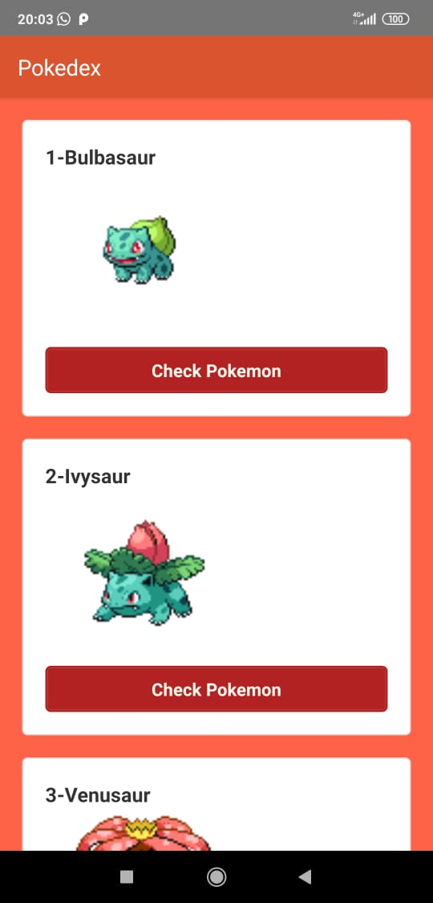
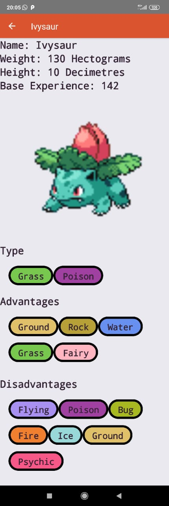

# PokeDex
A react-native android app for viewing pokemons and their abilities.

# Api Used

https://pokeapi.co/

# Installation =>
run npm install or yarn install after cloning...
To Run on device use
 --> react-native run-android
 

           
 # Link For direct download Of APK
   https://drive.google.com/file/d/1N7d8YrUF4cMVbPvkA8DZ3RxJx3Gw44B7/view?usp=sharing
   
 # App Functions
   The initial screen allows you to see various pokemons. You can select a pokemon and view its height, weight and other special abilities like advantages and disadvantages.
         
#### ScreenShots - Native App

